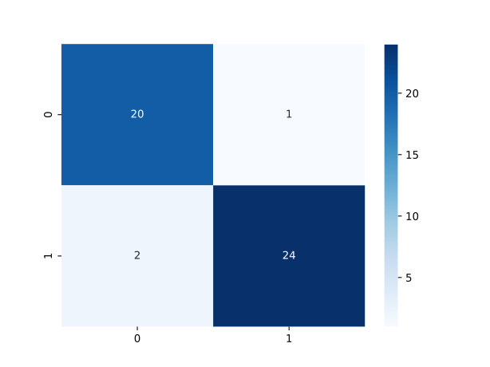

# YOLOv5 姿态估计部署

[[TOC]]

## 1. 技术简介

目前人体姿态估计总体分为 Top-down 和 Bottom-up 两种，与目标检测不同，无论是基于热力图或是基于检测器处理的关键点检测算法，都较为依赖计算资源，推理耗时略长，2022 年出现了以 YOLO 为基线的关键点检测器。[^1]

[^1]: *YOLO-Pose: Enhancing YOLO for Multi Person Pose Estimation Using Object Keypoint Similarity Loss*，<https://arxiv.org/abs/2204.06806>

在 ECCV 2022 和 CVPRW 2022 会议上，YoLo-Pose 和 KaPao 都基于流行的 YOLO 目标检测框架提出一种新颖的无热力图的方法[^1][^2]，YOLO Pose 一不使用检测器进行二阶处理，二部使用热力图拼接，虽然是一种暴力回归关键点的检测算法，但在处理速度上具有一定优势。

[^2]: *Rethinking Keypoint Representations: Modeling Keypoints and Poses as Objects for Multi-Person Human Pose Estimation*，<https://arxiv.org/abs/2111.08557>

对于人的姿势估计，它可以归结为一个单个类别检测器（对于人）。每个人有 $17$ 个关键点，而每个关键点又被确定为识别位置和置信度。因此，$17$ 个关键点有 $51$ 个元素与一个锚点（anchor）。因此，对于每个锚点需要预测 $51$ 个元素，预测框需要 $6$ 个元素。对于一个有 $n$ 个关键点的锚，整个预测向量被定义为

$$
P_v = \{
    C_x,\,C_y,\,W,\,H,\,\mathrm{box}_{conf},\,\mathrm{class}_{conf},\,K^1_x,\,K^1_y,\,K^1_{conf},\,\dots,\,K^n_x,\,K^n_y,\,K^n_{conf}
\}
$$

YOLO-Pose 使用的数据集是 Keypoints Labels of MS COCO 2017，数据集中每一行表示一个人的姿态标注。第一个值恒为 $0$，表示类别为人。后面的四个值分别是 $x,\,y$ 和宽高的归一化值，接下来是 $17$ 个关键点的位置。每一个关键点是一个长度为 $3$ 的数组，第一和第二个元素分别是 $x$ 和 $y$ 归一化坐标值，第三个元素是个标志位 $v$，$v$ 为 $0$ 时表示这个关键点没有标注（这种情况下 $x=y=v=0$），$v$ 为 $1$ 时表示这个关键点标注了但是不可见（被遮挡了），$v$ 为 $2$ 时表示这个关键点标注了同时也可见。

网络中每一个锚点（anchor）的输出值是 $P_v$，对于 YOLO，通常使用非极大值抑制来获取最终的输出结果。也就是说，我们最终会得到一个人的目标框和关键点信息。我们取所有关键点信息的归一化值来给下面的行为检测器使用。我们提取人的检测框，并使用检测框对 $17$ 个关键点进行归一化，这样我们就得到了 $51$ 维度的训练数据。

现在 YOLOv7 Pose[^3] 和 YOLOv8[^4] 都已经实现了这个算法，并且提供了相应的预训练模型。后续将提供相应的代码示例。

[^3]: YOLOv7-Pose，GitHub，<https://github.com/WongKinYiu/yolov7/tree/pose>

[^4]: YOLOv8，GitHub，<https://github.com/ultralytics/ultralytics>

## 2. YOLOv5 姿态估计

[下载 ONNX 预训练模型](http://software-dl.ti.com/jacinto7/esd/modelzoo/gplv3/latest/edgeai-yolov5/pretrained_models/models/keypoint/coco/edgeai-yolov5/yolov5s6_pose_640_ti_lite_54p9_82p2.onnx)，得到文件 `yolov5s6_pose_640_ti_lite_54p9_82p2.onnx`。

下面使用 ONNX Runtime 进行推理。

::: details 查看代码

@[code python](./src/main.py)

:::

如果我们需要对每个关键点基于检测框进行归一化，可以在 `post_process` 函数中添加如下代码：

```python
if kpts.size > 0:
    det_bbox = det_bboxes[0]
    x1, y1, x2, y2 = map(int, det_bbox)
    w, h = x2 - x1, y2 - y1
    kpts[0, 0::3] = (kpts[0, 0::3] - x1) / w
    kpts[0, 1::3] = (kpts[0, 1::3] - y1) / h
```

如果需要推理某个文件夹下的全部文件，修改 `build_train_data` 函数，最终会构建 CSV 文件。

## 3. 行为分类

有了关键点数据，我们就可以对行为进行分类。我们可以使用 [Kaggle 瑜伽姿态数据集](https://www.kaggle.com/datasets/niharika41298/yoga-poses-dataset)，这个数据集包含了 5 种不同的瑜伽姿势，每种姿势有 100~200 个样本[^5]。我们可以使用 SVM 分类器来对这些数据进行分类。

[^5]: 在 Python 中使用机器学习进行人体姿势估计，深度学习与计算机视觉——微信公众号，<https://mp.weixin.qq.com/s/D_sTpTp_pkLeO2nrcjgpaA>

下面是一个二分类的示例，用于分类摔倒和没有摔倒的图片，预处理方式相似，需要对检测框进行归一化，请参考上方代码，将数据保存为 CSV 文件。使用网格搜索查找最优参数，训练后绘制混淆矩阵，并打印准确率、精度、召回率和 F1 值。

::: details SVM 分类器示例

@[code python](./src/svm.py)

:::

本次测试每个类别 116 个样本，训练集 80%，测试集 20%，最终结果如下。

最优参数：

| C   | gamma | kernel |
| --- | ----- | ------ |
| 10  | 1     | `rbf`  |

| 参数表       | precision | recall | f1-score | support |
| ------------ | --------- | ------ | -------- | ------- |
| 0.0          | 0.91      | 0.95   | 0.93     | 21      |
| 1.0          | 0.96      | 0.92   | 0.94     | 26      |
| accuracy     | -         | -      | 0.94     | 47      |
| macro avg    | 0.93      | 0.94   | 0.94     | 47      |
| weighted avg | 0.94      | 0.94   | 0.94     | 47      |

混淆矩阵：


