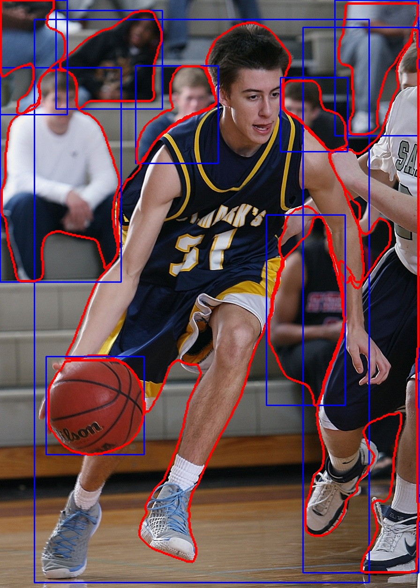

# 使用 YOLOv8 进行实例分割

[[TOC]]

::: info 源代码

本文的源代码参考了 [Pysource](https://pysource.com/2023/02/21/yolo-v8-segmentation)，如果需要下载请到此博客处下载。

:::

## 1. 安装 YOLOv8 环境

确保使用可用的 CUDA 环境以保证速度。

```bash
pip install ultralytics
pip install opencv-python
```

`ultralytics` 官方已经封装了各种 YOLOv8 的模型，我们不需要下载就可以使用，

## 2. YOLOv8 实例分割

我们先创建 `yolo_segmentation.py`：

@[code python](./src/yolo_segmentation.py)

然后创建 `main.py`：

@[code python](./src/main.py)

下面分别是实验用到的 `rugby.jpg` 和 `basket.jpg`，


::: info 版权图片

如果您需要图片的版权请访问他们的版权商：

- [rugby.jpg](https://www.pexels.com/it-it/foto/kigoa-football-su-erba-verde-durante-il-giorno-209956/)
- [basket.jpg](https://www.pexels.com/it-it/foto/uomo-che-gioca-a-basket-267761/)

:::

生成结果：




## 3. 视频示例

此外，这里还实现了一个视频示例，实时分割手机并标注：

@[code python](./src/phone.py)
