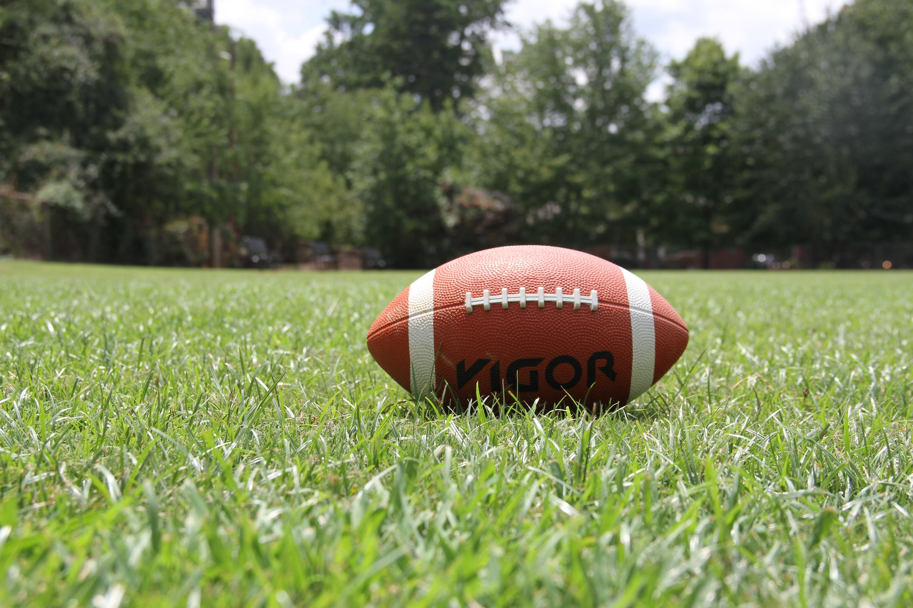
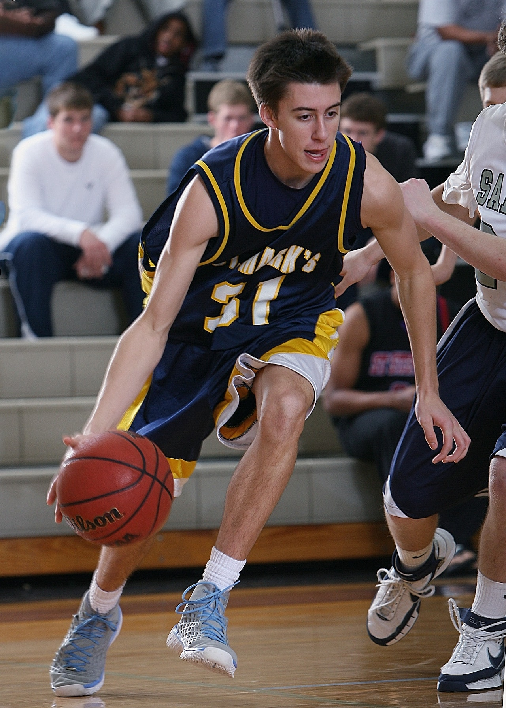

# OpenCV 和 YOLOv8 进行实例分割

[[TOC]]

::: info 源代码

您如果需要下载源代码，应该到 [Pysource](https://pysource.com/2023/02/21/yolo-v8-segmentation) 下载，本文只是引用其博客的内容。

:::

## 1. YOLOv8 环境

```bash
pip install ultralytics
pip install opencv-python
```

我们先创建 `yolo_segmentation.py`：

@[code python](./src/yolo_segmentation.py)

然后创建 `main.py`：

@[code python](./src/main.py)

下面分别是实验用到的 `rugby.jpg` 和 `basket.jpg`，





::: info 版权图片

如果您需要图片的版权请访问他们的版权商：
- [rugby.jpg](https://www.pexels.com/it-it/foto/kigoa-football-su-erba-verde-durante-il-giorno-209956/)
- [basket.jpg](https://www.pexels.com/it-it/foto/uomo-che-gioca-a-basket-267761/)

:::

生成结果：


