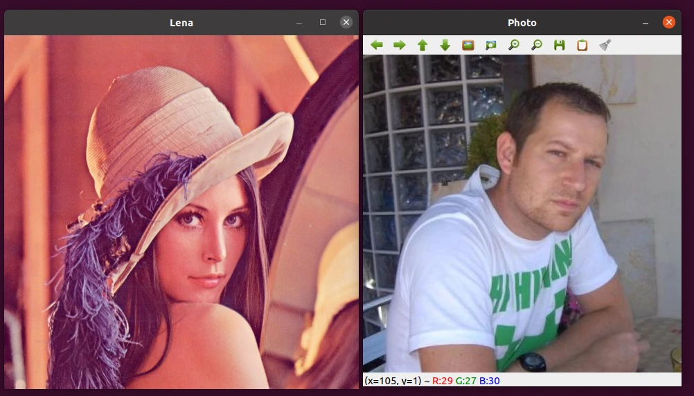
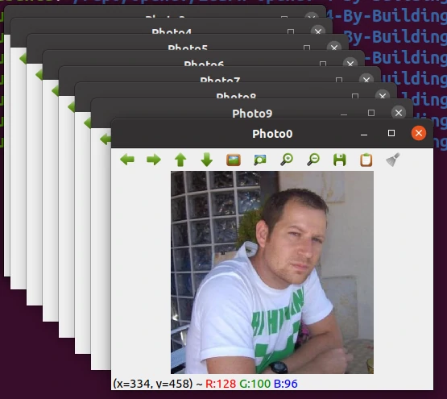

# 3. 学习图形用户界面

多数情况下，我们需要使用图形界面来显示我们的图像结果，并与用户交互。OpenCV 提供了基本的用户界面，以便创建应用程序和原型，为了更好地理解用户图形界面的工作原理，我们将创建一个名为 PhotoTool 的小应用程序，我们还将学习滤镜和颜色转换。

本章将介绍以下主题：
- [x] OpenCV 基本用户界面
- [x] OpenCV Qt 界面
- [x] 滑块和按钮
- [x] 高级用户界面：OpenGL
- [x] 颜色转换
- [x] 基本滤波器

## 3.1 技术要求

- [x] 熟悉 C++ 语言
- [x] [本章代码](https://github.com/PacktPublishing/Learn-OpenCV-4-By-Building-Projects-Second-Edition/tree/master/Chapter_03)
- [x] 现代操作系统，例如 Ubuntu 20+ 或者 Windows 10+

## 3.2 OpenCV 用户界面介绍

OpenCV 的用户界面是基础性的，提供了创建和管理软件开发的基本功能。这些功能都是原生的，并针对实时应用程序进行了优化。

OpenCV 提供两种用户界面选项：
- 基于原生用户界面的基本界面，适用于 Mac OS 的 cocoa 或 carbon，以及适用于 Linux 或 Windows 用户界面的 GTK，这些界面在编译 OpenCV 时被默认选择
- 基于 Qt 的跨平台的略微高级的界面，编译时需要手动启用



::: info 使用 Qt 支持的 OpenCV

如果需要编译支持 Qt 的 OpenCV，请阅读 [编译 Qt 支持的 OpenCV](../../opencv-development-practice/complie-and-build-guide/#_2-构建-qt-支持)。

:::

## 3.3 OpenCV 的基本图形用户界面

新建一个项目，编写 `main.cpp`：

```cpp
#include <iostream>
#include <string>
#include <sstream>

#include <opencv2/core.hpp>
#include <opencv2/highgui.hpp>

int main() {
    cv::Mat lena = cv::imread("lena.jpg");
    if (lena.empty()) {
        std::cout << "Could not read the image" << std::endl;
        return -1;
    }
    cv::Mat photo = cv::imread("photo.jpg");
    if (photo.empty()) {
        std::cout << "Could not read the image" << std::endl;
        return -1;
    }
    cv::namedWindow("Lena", cv::WINDOW_NORMAL);
    cv::namedWindow("Photo", cv::WINDOW_AUTOSIZE);

    cv::moveWindow("Lena", 10, 10);
    cv::moveWindow("Photo", 520, 10);

    cv::imshow("Lena", lena);
    cv::imshow("Photo", photo);

    cv::resizeWindow("Lena", 512, 512);
    cv::waitKey(0);

    cv::destroyWindow("Lena");
    cv::destroyWindow("Photo");

    for (int i = 0; i < 10; i++) {
        std::ostringstream ss;
        ss << "Photo" << i;
        cv::namedWindow(ss.str(), cv::WINDOW_NORMAL);
        cv::moveWindow(ss.str(), 20 * i, 20 * i);
        cv::imshow(ss.str(), photo);
    }
    cv::waitKey(0);
    cv::destroyAllWindows();
    return 0;
}
```

配置 `CMakeLists.txt`：

```cmake
cmake_minimum_required(VERSION 3.10)

project(Photo_Tool)

set(CMAKE_CXX_STANDARD 17)

find_package(OpenCV REQUIRED)
message(STATUS "OpenCV version: ${OpenCV_VERSION}")
include_directories(${OpenCV_INCLUDE_DIRS})
link_directories(${OpenCV_LIB_DIR})

add_executable(${PROJECT_NAME} main.cpp)
target_link_libraries(${PROJECT_NAME} ${OpenCV_LIBS})
```

编译运行：

```bash
mkdir -p build
cd build
cmake ..
make -j $(nproc)
cd ..

./build/Photo_Tool
```

::: info Windows 调试指南

如果你正在使用 Visual Studio 调试您的程序，可以使用 VS 内置的 CMake 功能来调试。如果您希望使用 MSVC 来编译，并使用命令行的 CMake 来调试，可以尝试下面的命令：

```bash
# CMake 配置
cmake -B ./build -G "Visual Studio 16 2019" -T host=x64 -A x64 .

# 编译命令
cmake --build ./build --config Release --target ALL_BUILD -j 4 --

# 执行
.\build\Release\Photo_Tool.exe
```

:::


按任意键，出现：



### 将滑块和鼠标事件添加到界面

使用滑块和鼠标事件可以让我们直接与界面交互，改变图像或变量的属性。

我们下面实现一个功能：鼠标可以绘制绿色圆圈，使用滑块进行模糊处理。

```c++

```

## 3.4 Qt 图形用户界面

## 3.5 OpenGL 支持

## 3.6 总结
