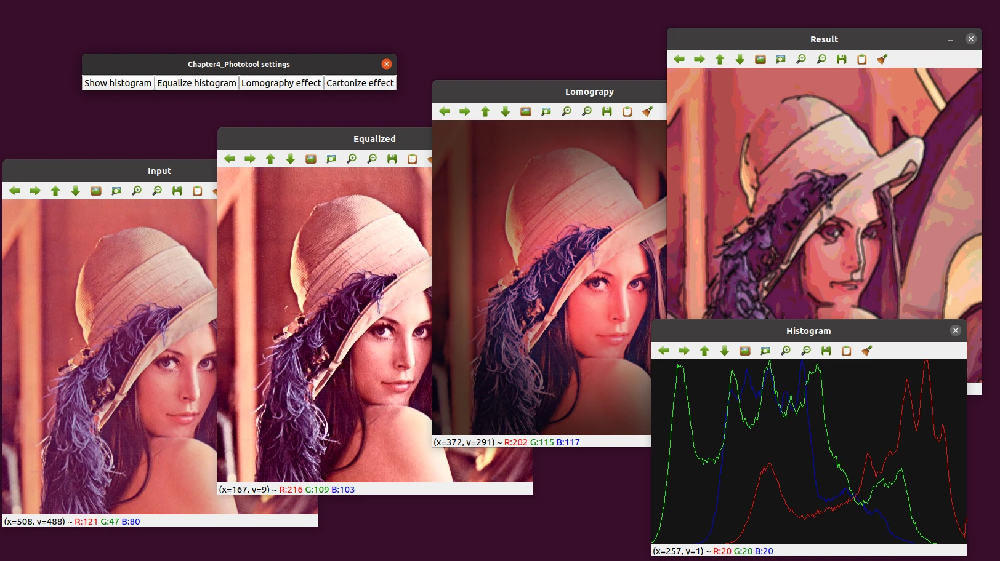

# 4. 深入研究直方图和滤波器

本章介绍以下主题：
- [x] 直方图和直方图均衡
- [x] 查找表
- [x] 模糊和中位数模糊
- [x] Canny 过滤器
- [x] 图像 - 颜色均衡
- [x] 图像类型之间的转换

我们还会创建一个完整的应用程序，因此本章还将涵盖以下主题：
- [x] 生成 CMake 脚本文件
- [x] 创建图像用户界面
- [x] 计算和绘制直方图
- [x] 直方图均衡
- [x] Lomography 相机效果
- [x] 卡通化效果

该应用程序将帮助我们了解如何从头开始创建整个项目，并理解直方图的概念。

## 4.1 技术要求

- [x] 熟悉 C++ 语言
- [x] [本章代码](https://github.com/PacktPublishing/Learn-OpenCV-4-By-Building-Projects-Second-Edition/tree/master/Chapter_04)
- [x] 现代操作系统，例如 Ubuntu 20+ 或者 Windows 10+

## 4.2 生成 CMake 脚本文件

基础的 `CMakeLists.txt` 文件：

```cmake
cmake_minimum_required(VERSION 3.0)

project(chapter_4_phototool)

set(CMAKE_CXX_STANDARD 11)

find_package(OpenCV REQUIRED)
message("OpenCV version: ${OpenCV_VERSION}")

include_directories(${OpenCV_INCLUDE_DIRS})
link_directories(${OpenCV_LIBRARY_DIRS})

add_executable(${PROJECT_NAME} main.cpp)
target_link_libraries(${PROJECT_NAME} ${OpenCV_LIBS})
```

本文的示例使用 C++ 11 标准。

## 4.3 创建图形用户界面

我们将使用基于 Qt 的 GUI，应用程序接收一个输入参数来加载要处理的图像。此外我们还有四个按钮：
- Show histogram（展示直方图）
- Equalize histogram（直方图均衡）
- Lomography effect（LOMO 效果）
- Cartoonize effect（卡通效果）



OpenCV 3.0 开始就包含了一个新的命令行解析器 `CommandLineParser`，首先我们先编写一个命令行解析图片路径的程序：

```cpp
#include <opencv2/core/utility.hpp>
#include <opencv2/highgui.hpp>
#include <opencv2/imgproc.hpp>

#include <iostream>
#include <string>
#include <vector>

const char* keys = {
    "{help h usage ? |      | print this message   }"
    "{@image         |<none>| image to process     }"};

cv::Mat img;

void showHistoCallback(int state, void* userData) {
}

void equalizeCallback(int state, void* userData) {
}

void lomoCallback(int state, void* userData) {
}

void cartoonCallback(int state, void* userData) {
}

int main(int argc, char** argv) {
    cv::CommandLineParser parser(argc, argv, keys);
    parser.about("This program shows how to read an image from a file.");
    if (parser.has("help")) {
        parser.printMessage();
        return 0;
    }
    std::string image_path = parser.get<std::string>(0);
    if (!parser.check()) {
        parser.printErrors();
        return 0;
    }
    img = cv::imread(image_path, cv::IMREAD_COLOR);
    if (img.empty()) {
        std::cout << "Could not read the image: " << image_path << std::endl;
        return -1;
    }
    cv::namedWindow("Input", cv::WINDOW_AUTOSIZE);

    cv::createButton("Show histogram", showHistoCallback, nullptr, cv::QT_PUSH_BUTTON, false);
    cv::createButton("Equalize histogram", equalizeCallback, nullptr);
    cv::createButton("Lomography effect", lomoCallback, nullptr);
    cv::createButton("Cartoonize effect", cartoonCallback, nullptr);

    cv::imshow("Input", img);
    cv::waitKey(0);
    return 0;
}
```

我们有四个未完成的函数，下面我们将实现这四个函数。

## 4.4 绘制直方图

```cpp

```
