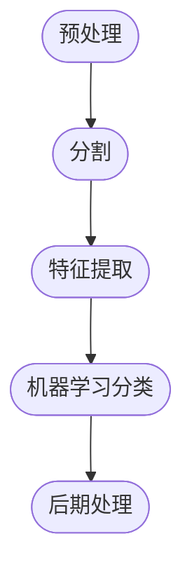

# 5. 自动光学检查、对象分割和检测

本章介绍以下主题：
- [x] 噪声消除
- [x] 光 / 背景去除知识
- [x] 阈值
- [x] 用于对象分割的连通组件
- [x] 对象分割中的轮廓查找

许多行业都会使用复杂的计算机视觉系统和硬件，计算机视觉技术可以用于检测问题并最大限度地减少生产过程中产生的错误，从而提高最终产品的质量。

在这个领域中，计算机视觉任务是 **自动光学检查**（AOI）。如今，使用不同的相机的光学检查技术以及复杂的算法正在成千上万的行业中应用，例如用于缺陷检测、分类等。

## 5.1 技术要求

- [x] 熟悉 C++ 语言
- [x] [本章代码](https://github.com/PacktPublishing/Learn-OpenCV-4-By-Building-Projects-Second-Edition/tree/master/Chapter_05)
- [x] 现代操作系统，例如 Ubuntu 20+ 或者 Windows 10+

## 5.2 隔离场景中的对象



## 5.3 为 AOI 创建应用程序

本节我们创建一个命令行程序，其参数构成如下：
1. 要被处理的图像
2. 光图像模式
    - 0，代表减法操作，即求差异
    - 1，代表除法运算
3. 分割
    - 1，采用用于分割的连通组件方法
    - 2，采用具有统计区域的连通组件方法
    - 3，将查找轮廓的方法应用于分割

我们的命令行解析器如下：

```cpp

```


