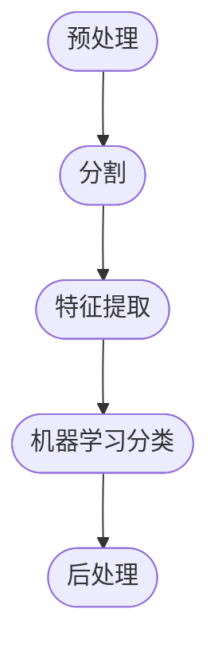

# 6. 学习对象分类

本章介绍机器学习的基本概念，以便对不同的图像进行分类。对于检测到的对象，我们使用机器学习算法提取被分类对象的不同特征。基于上一章的分割算法，创建 GUI 程序显示分类结果。

本章介绍以下主题：
- [x] 机器学习概念介绍
- [x] 常见机器学习算法和过程
- [x] 特征提取
- [x] 支持向量机(SVM)
- [x] 训练和预测

## 6.1 技术要求

- [x] 熟悉 C++ 语言
- [x] [本章代码](https://github.com/PacktPublishing/Learn-OpenCV-4-By-Building-Projects-Second-Edition/tree/master/Chapter_06)
- [x] 现代操作系统，例如 Ubuntu 20+ 或者 Windows 10+

## 6.2 机器学习概念介绍

::: tip 学习提示

笔记不会记录机器学习有关概念，如果要系统学习建议从机器学习原理部分系统化学习。

:::

下面我们将使用监督学习和分类算法，这需要使用带有标签的数据集来训练模型。

下面是一些比较流行的方法：
- 支持向量机（SVM）
- 人工神经网络（ANN）
- 聚类
- K-最近邻（KNN）
- 决策树
- 深度学习

本章我们将解释支持向量机。

### OpenCV 机器学习算法

OpenCV 实现了其中八种机器学习算法，所有这些算法都继承自 `StatModel` 类，这八种算法是:
- 人工神经网络
- 随机树
- 期望最大化
- K-最近邻
- 逻辑回归
- 朴素贝叶斯分类器
- 支持向量机
- 随机梯度下降 SVM


`StatModel` 是 SVM 或 ANN 等机器学习类的基类，提供所有预测和读写等功能。`StatModel` 基本上是一个虚拟的类，其两个最重要的函数 `train()` 和 `predict()`。`train()` 方法是负责训练数据集学习模型参数的主要方法，存在下面几种声明方式：

```cpp
virtual bool train(const Ptr<TrainData>& trainData, int flag=0);
virtual bool train(InputArray samples, int layout, InputArray responses);
template<typename _Tp> static Ptr<_Tp> train(const Ptr<TrainData>& data, int flags=0)
```

其参数含义：
- `trainData`：从 `TrainData` 类加载或创建的训练数据
- `samples`：一系列训练样本
- `layout`：`ROW_SAMPLE` 表示训练样本是矩阵行，`COL_SAMPLE` 表示矩阵列
- `responses`：与样本数据相关的响应向量
- `flags`：由每个方法定义的可选标志

其中最后一个方法创建并训练一个 `_Tp` 类型的模型，

`predict()` 方法只有一种调用方式：

```cpp
float StatModel::predict(InputArray samples, OutputArray results=noArray(), int flag=0);
```

该预测函数具有以下参数：
- `samples`：用于预测模型结果的输入样本，可以包含任意数量的数据

<!-- TODO -->

## 6.3 计算机视觉和机器学习工作流程

具备机器学习的计算机视觉应用具有的共同基本结构，这种结构分为不同的步骤：
1. 预处理
    - 几乎所有的计算机视觉应用程序都是以预处理开始
    - 包括去除光和噪声、滤波、模糊等
2. 分割
    - 提取图像中的 ROI（感兴趣区域）
    - 将每个区域隔离为感兴趣的唯一对象
3. 特征提取
    - 提取对象的特征，特征通常是特征向量
    - 特征用于描述对象，可以是区域、轮廓、纹理、像素等
4. 分类结果
    - 将数据输入机器学习模型，预测分类或回归的结果
5. 后处理
    - 针对模型预测结果进行处理，获取所需的最终数据



::: info OpenCV 机器学习官方文档

有关机器学习模块的详细问题，阅读 [OpenCV ML 官方文档](https://docs.opencv.org/master/dd/ded/group__ml.html)。

:::

## 6.4 自动对象检查分类示例

执行步骤:
1. 对于每个输入图像
    - 预处理图像
    - 分隔图像
2. 对于图像中的每隔对象
    - 特征提取
    - 使用相应的标签将这些提取出的特征添加到训练特征向量中
3. 创建 SVM 模型
4. 使用训练特征向量训练 SVM 模型
5. 预处理输入图像以便对每个被分割的对象进行分类
6. 分割输入的图像
7. 对于检测到的每个对象
    - 提取特征
    - 用 SVM 预测它
    - 建模
    - 在输出图像中绘制结果

### 6.4.1 特征提取

### 6.4.2 训练 SVM 模型

### 6.4.3 输入图像预测

## 6.5 总结

本章通过一个监督学习示例，使用 SVM 创建对象分类模型。我们必须能够准确选择能描述对象的特征，并且尽可能提供最佳的预测模型。
