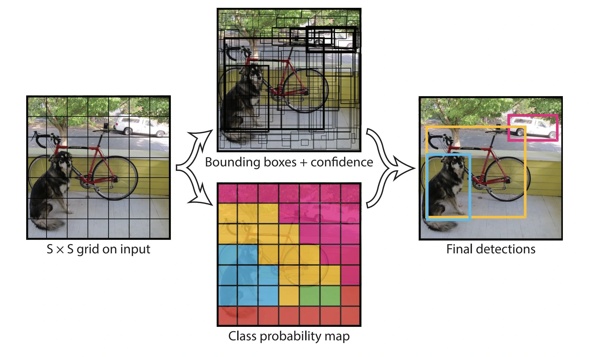

# 12. 使用 OpenCV 进行深度学习

本章我们将使用 OpenCV 的深度学习接口，并将其用于目标检测和人脸检测。

本章介绍以下主题：
- [x] 什么是深度学习
- [x] OpenCV 如何与深度学习合作，以及如何实现深度学习神经网络（NN）
- [x] YOLO，一种非常快速的深度学习对象检测算法
- [x] 使用 SSD 进行人脸检测

## 12.1 技术要求

- [x] 使用编译有深度学习模块（`dnn`）的 OpenCV
- [x] 推荐使用支持 CUDA 的 NVIDIA GPU
- [x] [本章代码](https://github.com/PacktPublishing/Learn-OpenCV-4-By-Building-Projects-Second-Edition/tree/master/Chapter_12)

## 12.2 深度学习简介

::: tip 学习提示

如果需要了解，只靠本节的内容不足以了解，所以这里没有这部分笔记，建议有深度学习基础再阅读本章。

:::

## 12.3 OpenCV 中的深度学习

深度学习模块在 3.1 作为贡献模块引入，并成为 3.3 版本的一部分。但直到 3.4.3+ 和 4.x 版本才被广泛使用。

OpenCV 不支持反向传播，这意味 OpenCV 只能使用训练好的网络进行前向推理。这是因为 OpenCV 没有必要实现别人（PyTorch、TensorFlow 等）擅长的东西，OpenCV 更适合部署，因此应该专注于优化推理的计算速度。

你可以从头开始创建网络，也可以使用现有的网络。有一些网站（例如 *TensorEditor*（已失效） 和 [lobe.ai](https://www.lobe.ai/)）能够从可视化的设计器中生成代码来方便我们进行训练。

当我们得到一个令人满意的神经网络，我们就可以把网络的结构和参数导入到 OpenCV 中进行推理啦。

## 12.4 YOLO 用于实时对象检测

YOLO 是目前最快的对象检测和识别算法之一，NVIDIA Titan X 上可以达到 30 fps（YOLOv3）。

::: info YOLOv7 是更好的选择

当前（2022 年 11 月 11 日）YOLOv7 比以前的版本更快也更加精确，后面也将 YOLOv7 的 OpenCV 部署发布出来。

:::

### 12.4.1 YOLOv3 深度学习模型架构

YOLO 把整张图像划分成 $S \times S$ 大小的网络，对于每个网格，YOLO 网络模型预测 $B$ 个边界框，然后得出边界框包含可能对象的置信度。



::: info 预测框

在上面的例子中，图片被分成了 49 个框，每个框预测 2 个预测框（bounding box），因此上面的图中有 98 个预测框。

可以看到这些预测框中有的边框比较粗，有的比较细，这是置信度不同的表现，置信度高的比较粗，置信度低的比较细。

:::

每个预测框有 5 个量，即中心位置（$x,\,y$）、宽高（$w,\,h$）和置信度。

输出结果的总数应该是：

$$
S \times S \times B \times (5 + \mathrm{classes})
$$

YOLO 默认使用 80 个类别 $19 \times 19$ 个网格，5 个分量即预测框的 5 个量，类别数使用 $\mathrm{classes}$ 表示，即 $\mathrm{classes} = 80$，这里的类别用 One-Hot 编码表示，总数为：

$$
19 \times 19 \times 5 \times (5 + 80) = 425
$$

排列方式是：

$$
S \times S \times B \times
\begin{bmatrix}
    x,\, y,\, w,\, h,\, \mathrm{conf},\, c_1,\,
    c_2,\, \cdots,\, c_{80}
\end{bmatrix}
$$

YOLOv3 架构基于 DarkNet，DarkNet 包含 53 个网络层，YOLOv3 增加了 53 个 层，所以它有 106 层。如果需要更小更快，可以参考 TinyYOLO 或其他迷你版本。

### 12.4.2 YOLO 数据集、词汇表和模型

YOLO 使用 COCO 数据集，COCO 数据集包含 80 个类别。

下载文件：
- 模型文件：`https://pjreddie.com/media/files/yolov3.weights`
- 网络文件：`https://github.com/pjreddie/darknet/blob/master/cfg/yolov3.cfg`
- 词汇表：`https://github.com/pjreddie/darknet/blob/master/data/coco.names`

将 `yolov3.weights`、`yolov3.cfg` 和 `coco.names` 放置在本项目的根目录。

### 12.4.3 将 YOLO 导入 OpenCV

深度学习模块需要使用命名空间 `cv::dnn`，引入 `<opencv2/dnn.hpp>`。

OpenCV 的 `Mat` 图像需要转换为 DNN 张量 / Blob 格式才能输入到神经网络中，可以使用 `cv::dnn::blobFromImage()` 函数进行转换。

`cv::dnn::blobFromImage()` 函数的声明如下：

```cpp
void blobFromImage(
    InputArray image,
    OutputArray blob,
    double scalefactor=1.0,
    const Size& size = Size(),
    const Scalar& mean = Scalar(),
    bool swapRB=false,
    bool crop=false,
    int ddepth=CV_32F
);

Mat blobFromImage(
    InputArray image,
    double scalefactor=1.0,
    const Size& size = Size(),
    const Scalar& mean = Scalar(),
    bool swapRB=false,
    bool crop=false,
    int ddepth=CV_32F
);
```

其参数如下：
- `image`：输入图像（可能是 1、3 或 4 通道）
- `blob`：输出 `Mat` 对象
- `scalefactor`：图像值乘数
- `size`：
- `mean`：
- `swapRB`：交换颜色通道
- `crop`：是否裁剪
- `ddepth`：

我们的代码大致如下，其中的后处理和获取输出名称的函数并未进行实现，完整的实现可以参考本章的代码仓库。

```cpp
#include <fstream>
#include <iostream>
#include <sstream>

#include <opencv2/core.hpp>
#include <opencv2/dnn.hpp>
#include <opencv2/highgui.hpp>
#include <opencv2/imgproc.hpp>

constexpr float CONFIDENCE_THRESHOLD = 0.5;
constexpr float NMS_THRESHOLD = 0.4;
constexpr int INPUT_WIDTH = 416;
constexpr int INPUT_HEIGHT = 416;

std::vector<std::string> classes;

std::vector<std::string> getOutputsNames(const cv::dnn::Net& net) {
}

void postprocess(cv::Mat& frame, const std::vector<cv::Mat>& outs) {
}

int main(int argc, char* argv[]) {
    if (argc < 2) {
        std::cout << "Usage: " << argv[0] << " <image>" << std::endl;
        return -1;
    }
    std::string classesFile = "coco.names";
    std::ifstream ifs(classesFile.c_str());
    std::string line;
    while (std::getline(ifs, line))
        classes.push_back(line);

    std::string modelConfiguration = "yolov3.cfg";
    std::string modelWeights = "yolov3.weights";

    cv::dnn::Net net = cv::dnn::readNetFromDarknet(modelConfiguration, modelWeights);
    net.setPreferableBackend(cv::dnn::DNN_BACKEND_OPENCV);
    net.setPreferableTarget(cv::dnn::DNN_TARGET_CPU);

    cv::Mat input, blob;
    input = cv::imread(argv[1]);
    if (input.empty()) {
        std::cout << "Could not read the image: " << argv[1] << std::endl;
        return -1;
    }

    cv::dnn::blobFromImage(input, blob, 1 / 255.f, cv::Size(INPUT_WIDTH, INPUT_HEIGHT), cv::Scalar(0, 0, 0), true, false);
    net.setInput(blob);

    std::vector<cv::Mat> outs;
    net.forward(outs, getOutputsNames(net));

    postprocess(input, outs);

#ifndef Profile
    std::vector<double> layersTimes;
    double freq = cv::getTickFrequency() / 1000;
    double t = net.getPerfProfile(layersTimes) / freq;
    std::string label = cv::format("Inference time for a frame : %.2f ms", t);
    std::cout << label << std::endl;
#endif

    cv::imshow("object detection", input);
    cv::waitKey();

    return 0;
}
```

## 12.5 使用 SSD 进行人脸检测

单摄检测（Single Shot Detection，SSD）是另一种快速、准确的深度学习对象检测方法，它具有和 YOLO 类似的概念，可以在同一架构预测对象和边界框。

### 12.5.1 SSD 模型架构

### 12.5.2 将 SSD 人脸检测导入 OpenCV

本文的 SSD 模型使用 Caffe 格式，需要 OpenCV 使用 `cv::dnn::readNetFromCaffe()` 来创建网络。

@[code cpp](./src/ssd_face.cpp)

## 12.6 总结
