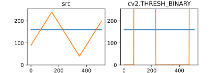
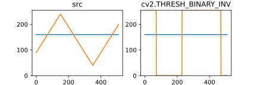
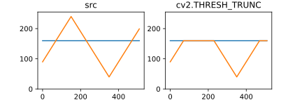
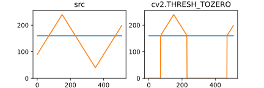
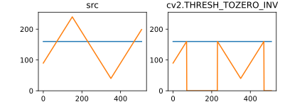

# 4. OpenCV 中的图像处理

## 4.1 颜色空间转换

::: details 学习目标

- 对图像进行颜色空间转换，比如从 BGR 到灰度图，或者从 BGR 到 HSV 等
- 创建一个程序用来从一幅图像中获取某个特定颜色的物体
- 函数
  - `cv2.cvtColor()` 转换颜色空间
  - `cv2.inRange()` 在范围内的图像
- 语法
  - `cv2.cvtColor(src, code, dst=..., dstCn=...)`
  - `cv2.inRange(src, lowerb, upperb, dst=...)`

:::

### 4.1.1 转换颜色空间

最经常用到的颜色转换：

- BGR 与灰度图相互转换
- BGR 与 HSV 相互转换

获取有多少种颜色代码：

```python
import cv2

def print_const(prefix: str) -> None:
    prefix += '_'
    names = (
        '{:22} = {:5}'.format(key, val)
        for key, val in vars(cv2).items()
        if key.startswith(prefix)
    )
    print(*names, sep='\n')

print_const('COLOR')
```

最常用的是 `cv2.COLOR_BGR2GRAY` 和 `cv2.COLOR_BGR2HSV`。

在 OpenCV 的 HSV 格式中：

- $H$（色彩/色度）的取值范围是 `[0, 179]`
- $S$（饱和度）的取值范围 `[0, 255]`
- $V$（亮度）的取值范围 `[0, 255]`

不同的软件使用的值可能不同。所以当你需要拿 OpenCV 的 HSV 值与其它软件的 HSV 值进行对比时，一定要记得归一化。

### 4.1.2 物体跟踪

在 HSV 颜色空间中要比在 BGR 空间中更容易表示一个特定颜色。在我们的程序中，我们要提取的是一个蓝色的物体。下面就是就是我们要做的几步：

1. 从视频中获取每一帧图像
2. 将图像转换到 HSV 空间
3. 设置 HSV 阈值到蓝色范围
4. 获取蓝色物体

```python
import cv2
import numpy as np

BLUE_LOWER = np.array([110, 50, 50])
BLUE_UPPER = np.array([130, 255, 255])

cap = cv2.VideoCapture(0)

while cap.isOpened():
    ret, frame = cap.read()
    hsv = cv2.cvtColor(frame, cv2.COLOR_BGR2HSV)
    mask = cv2.inRange(hsv, lowerb=BLUE_LOWER,
                       upperb=BLUE_UPPER)
    res = cv2.bitwise_and(frame, frame, mask=mask)

    cv2.imshow('frame', frame)
    cv2.imshow('mask', mask)
    cv2.imshow('res', res)
    key = cv2.waitKey(5) & 0xff
    if key == 27:
        break

cv2.destroyAllWindows()
```

图像中仍然有一些噪音，我们会在后面的章节中介绍如何消减噪音。

### 4.1.3 怎样找到要跟踪对象的 HSV 值？

我们遇到的最普遍的问题大概是怎么确定对象的 HSV 值。例如，我们要找到绿色的 HSV 值，我们只需在终端输入以下命令：

```python
import cv2
import numpy as np

green = np.array([[[0, 255, 0]]], dtype=np.uint8)
hsv_green = cv2.cvtColor(green, cv2.COLOR_BGR2HSV)
print(hsv_green)
## [[[ 60 255 255]]]
```

现在你可以分别用 `[H-100, 100, 100]` 和 `[H+100, 255, 255]` 做上下阈值。

## 4.2 几何变换

::: details 学习目标

- 对图像进行各种几个变换，例如移动，旋转，仿射变换
- 函数
  - `cv2.getPerspectiveTransform()`

:::

OpenCV 提供了两个变换函数，`cv2.warpAffine()` 和 `cv2.warpPerspective()`，使用这两个函数你可以实现所有类型的变换。

区别：

- `cv2.warpAffine()` 接收的参数是 $2 \times 3$ 的变换矩阵
- `cv2.warpPerspective()` 接收的参数是 $3 \times 3$ 的变换矩阵

### 4.2.1 扩展缩放

扩展缩放只是改变图像的尺寸大小。OpenCV 提供的函数 `cv2.resize()` 可以实现这个功能。图像的尺寸可以自己手动设置，你也可以指定缩放因子。我们可以选择使用不同的插值方法。在缩放时我们推荐使用 `cv2.INTER_AREA`，在扩展时我们推荐使用 `cv2.INTER_CUBIC`（慢) 和 `v2.INTER_LINEAR`。

默认情况下所有改变图像尺寸大小的操作使用的插值方法都是 `cv2.INTER_LINEAR`。你可以使用下面任意一种方法改变图像的尺寸：

```python
import cv2
import numpy as np

img = cv2.imread('messi5.jpg')

# 方法 1
res = cv2.resize(img, None, fx=2, fy=2, interpolation=cv2.INTER_CUBIC)

# 方法 2
height, width = img.shape[:2]
res = cv2.resize(img,(2*width,2*height),interpolation=cv2.INTER_CUBIC)

cv2.imshow('res', res)
cv2.imshow('img', img)
cv2.waitKey()
cv2.destroyAllWindows()
```

### 4.2.2 平移

沿着 $(x,\,y)$ 方向移动，移动距离是 $(t_x,\,t_y)$，移动矩阵即为

$$
M = \begin{bmatrix}
    1 & 0 & t_x \\
    0 & 1 & t_y
\end{bmatrix}
$$

可以使用 NumPy 数组构建这个矩阵（数据类型是 `np.float32`），然
后把它传给函数 `cv2.warpAffine()`。

```python
import numpy as np
import cv2

img = cv2.imread('t1.jpg')

cv2.imshow('image', img)
height, width, _ = img.shape

mat_translation = np.float32([[1, 0, 20], [0, 1, 50]])
dst = cv2.warpAffine(img, mat_translation, (width+20, height+50))

cv2.imshow('dst', dst)
cv2.waitKey()
cv2.destroyAllWindows()
```

::: warning 通道顺序

函数 `cv2.warpAffine()` 的第三个参数的是输出图像的大小，它的格式应该是（宽，高）。应该记住的是图像的宽对应的是列数，高对应的是行数。

:::

### 4.2.3 旋转

对一个图像旋转角度 $\theta$，需要使用到下面形式的旋转矩阵

$$
M = \begin{bmatrix}
    \cos \theta & -\sin \theta \\
    \sin \theta & \cos \theta
\end{bmatrix}
$$

但是 OpenCV 允许你在任意地方进行旋转，但是旋转矩阵的形式应该修改为

$$
\begin{bmatrix}
    \alpha & \beta & \left(1 - \alpha\right) \cdot
    \mathrm{center}_x - \beta \cdot \mathrm{center}_y \\
    -\beta & \alpha & \beta \cdot \mathrm{center}_y +
    \left(1 + \alpha\right) \cdot \mathrm{center}_x
\end{bmatrix}
$$

其中

$$
\alpha = \mathrm{scale} \cdot \cos \theta
$$

$$
\beta = \mathrm{scale} \cdot \sin \theta
$$

为了构建这个旋转矩阵，OpenCV 提供了一个函数：`cv2.getRotationMatrix2D()`，下面的例子是在不缩放的情况下将图像旋转 $90 \degree$。

### 4.2.4 仿射变换

在仿射变换中，原图中所有的平行线在结果图像中同样平行。为了创建这
个矩阵我们需要从原图像中找到三个点以及他们在输出图像中的位置。

然后 `cv2.getAffineTransform()` 会创建一个 $2 \times 3$ 的矩阵，最后这个矩阵会被传给函数 `cv2.warpAffine()`。

```python
import cv2
import numpy as np
from matplotlib import pyplot as plt

img = cv2.imread('test.jpg')
rows, cols, ch = img.shape
pts1 = np.float32([[50, 50], [200, 50], [50, 200]])
pts2 = np.float32([[10, 100], [200, 50], [100, 250]])

M = cv2.getAffineTransform(pts1, pts2)
dst = cv2.warpAffine(img, M, (cols, rows))

plt.subplot(121)
plt.imshow(img[..., ::-1])
plt.title('Input')
plt.subplot(122)
plt.imshow(dst[..., ::-1])
plt.title('Output')
plt.show()
```

### 4.2.5 透视变换

对于视角变换，我们需要一个 $3 \times 3$ 变换矩阵。在变换前后直线还是直线。

要构建这个变换矩阵，你需要在输入图像上找 4 个点，以及他们在输出图像上对应的位置。这四个点中的任意三个都不能共线。这个变换矩阵可以有函数 `cv2.getPerspectiveTransform()` 构建。然后把这个矩阵传给函数 `cv2.warpPerspective()`。

```python
import cv2
import numpy as np
from matplotlib import pyplot as plt

img = cv2.imread('test.jpg')
rows, cols, ch = img.shape

pts1 = np.float32([[56, 65], [368, 52], [28, 387], [389, 390]])
pts2 = np.float32([[0, 0], [300, 0], [0, 300], [300, 300]])

M = cv2.getPerspectiveTransform(pts1, pts2)
dst = cv2.warpPerspective(img, M, (300, 300))

plt.subplot(121)
plt.imshow(img[..., ::-1])
plt.title('Input')
plt.subplot(122)
plt.imshow(dst[..., ::-1])
plt.title('Output')
plt.show()
```

## 4.3 图像阈值

::: details 学习目标

- 简单阈值
- 自适应阈值
- Otsu’s 二值化
- 函数
  - `cv2.threshold()`
  - `cv2.adaptiveThreshold()`

:::

### 4.3.1 简单阈值

正如其名，这种方法非常简单。像素值高于阈值时，我们给这个像素赋予一个新值（可能是白色），否则我们给它赋予另外一种颜色（也许是黑色）。这个函数就是 `cv2.threshhold()`。

这个函数的第一个参数就是原图像，原图像应该是灰度图。第二个参数就是用来对像素值进行分类的阈值。第三个参数就是当像素值高于（有时是小于）阈值时应该被赋予的新的像素值。OpenCV 提供了多种不同的阈值方法，这是有第四个参数来决定的。这些方法包括：

- `cv2.THRESH_BINARY`
    ::: center
    
    :::
- `cv2.THRESH_BINARY_INV`
    ::: center
    
    :::
- `cv2.THRESH_TRUNC`
    ::: center
    
    :::
- `cv2.THRESH_TOZERO`
    ::: center
    
    :::
- `cv2.THRESH_TOZERO_INV`
    ::: center
    
    :::

::: details 如何绘制这些图？

事实上，我们正是用 `cv2.threshold()` 这个函数本身来绘制这些图表。

```python
import cv2
import numpy as np
from matplotlib import pyplot as plt

src = np.array([[
    *range(90, 240, 1),
    *range(240, 40, -1),
    *range(40, 200, 1)
]], dtype=np.uint8)

line = np.array(len(src[0]) * [160], dtype=np.uint8)

threshs = [
    'THRESH_BINARY',
    'THRESH_BINARY_INV',
    'THRESH_TRUNC',
    'THRESH_TOZERO',
    'THRESH_TOZERO_INV',
]

for name in threshs:
    ret, thresh = cv2.threshold(src, 160, 255, getattr(cv2, name))
    plt.figure(figsize=(6, 2))
    plt.subplot(121)
    plt.title('src')
    plt.ylim(0, 255)
    plt.plot(line)
    plt.plot(src[0])
    plt.subplot(122)
    plt.title('cv2.' + name)
    plt.ylim(0, 255)
    plt.plot(line)
    plt.plot(thresh[0])
    # plt.show()
    plt.savefig(name + '.svg')
```

:::

```python
import cv2
import numpy as np
from matplotlib import pyplot as plt

img = cv2.imread('test.jpg', 0)

ret, thresh1 = cv2.threshold(img, 127, 255, cv2.THRESH_BINARY)
ret, thresh2 = cv2.threshold(img, 127, 255, cv2.THRESH_BINARY_INV)
ret, thresh3 = cv2.threshold(img, 127, 255, cv2.THRESH_TRUNC)
ret, thresh4 = cv2.threshold(img, 127, 255, cv2.THRESH_TOZERO)
ret, thresh5 = cv2.threshold(img, 127, 255, cv2.THRESH_TOZERO_INV)

titles = [
    'Original Image',
    'THRESH_BINARY',
    'THRESH_BINARY_INV',
    'THRESH_TRUNC',
    'THRESH_TOZERO',
    'THRESH_TOZERO_INV',
]
images = [img, thresh1, thresh2, thresh3, thresh4, thresh5]
for i in range(6):
    plt.subplot(2, 3, i+1), plt.imshow(images[i], 'gray')
    plt.title(titles[i])
    plt.xticks([])
    plt.yticks([])
plt.show()
```

### 4.3.2 自适应阈值

在前面的部分我们使用是全局阈值，整幅图像采用同一个数作为阈值。当这种方法并不适应与所有情况，尤其是当同一幅图像上的不同部分的具有不同亮度时，我们需要采用自适应阈值。此时的阈值是根据图像上的每一个小区域计算与其对应的阈值。因此在同一幅图像上的不同区域采用的是不同的阈值，从而使我们能在亮度不同的情况下得到更好的结果。

此函数返回目标图像，参数如下：

- `maxValue`：最大值
- `adaptiveMethod`：指定计算阈值的方法
  - `cv2.ADPTIVE_THRESH_MEAN_C`：阈值取自相邻区域的平均值
  - `cv2.ADPTIVE_THRESH_GAUSSIAN_C`：阈值取值相邻区域的加权和，权重为一个高斯窗口
- `thresholdType`：和上一节一致，二值化方式
- `blockSize`：邻域大小（用来计算阈值的区域大小），只能是奇数
- `C`：这就是是一个常数，阈值就等于的平均值或者加权平均值减去这个常数

```python
import cv2
import numpy as np
from matplotlib import pyplot as plt

img = cv2.imread('test.jpg', 0)
# 中值滤波
img = cv2.medianBlur(img, 5)
ret, th1 = cv2.threshold(img, 127, 255, cv2.THRESH_BINARY)
# 11 为 Block size, 2 为 C 值
th2 = cv2.adaptiveThreshold(img, 255, cv2.ADAPTIVE_THRESH_MEAN_C,
                            cv2.THRESH_BINARY, 11, 2)
th3 = cv2.adaptiveThreshold(img, 255, cv2.ADAPTIVE_THRESH_GAUSSIAN_C,
                            cv2.THRESH_BINARY, 11, 2)
titles = ['Original Image', 'Global Thresholding (v = 127)',
          'Adaptive Mean Thresholding', 'Adaptive Gaussian Thresholding']
images = [img, th1, th2, th3]
for i in range(4):
    plt.subplot(2, 2, i+1), plt.imshow(images[i], 'gray')
    plt.title(titles[i])
    plt.xticks([])
    plt.yticks([])
plt.show()
```

### 4.3.3 Otsu’s 二值化

在使用全局阈值时，我们怎么知道我们选取的这个数的好坏呢？答案就是不停的尝试。

如果是一副双峰图像（简单来说双峰图像是指图像直方图中存在两个峰）呢？我们岂不是应该在两个峰之间的峰谷选一个值作为阈值？这就是 Otsu 二值化要做的。简单来说就是对一副双峰图像自动根据其直方图计算出一个阈值。（对于非双峰图像，这种方法得到的结果可能会不理想）。

这里用到到的函数还是 `cv2.threshold()`，但是需要多传入一个参数（`flag: cv2.THRESH_OTSU`）。这时要把阈值设为 `0`。然后算法会找到最优阈值，这个最优阈值就是返回值 `retVal`。

```python
import cv2
from matplotlib import pyplot as plt

img = cv2.imread('test.jpg', 0)
ret, thresh = cv2.threshold(img, 0, 255, cv2.THRESH_BINARY + cv2.THRESH_OTSU)

plt.subplot(221)
plt.imshow(img, cmap='gray')
plt.title('Original');plt.xticks([]);plt.yticks([])

plt.subplot(222)
plt.imshow(thresh, cmap='gray')
plt.title('Otsu');plt.xticks([]);plt.yticks([])

plt.subplot(223)
plt.hist(img.ravel(), 256)
plt.axvline(x=ret, color='r', linestyle='dashed', linewidth=1)
plt.title('Histogram')

plt.show()
```

### 4.3.4 Otsu’s 二值化是如何工作的？

这一部分演示使用 Python 来实现 Otsu 二值化算法。

因为是双峰图，Otsu 算法就是要找到一个阈值（$t$），使得同一类加权方差最小，需要满足下列关系式：

$$
\sigma_\omega^2(t) = q_1(t)\sigma^2_1(t) + q_2(t)\sigma^2_2(t)
$$

其中

$$
\left\{
\begin{aligned}
    q_1(t) = \sum_{i=1}^t P(i) \\
    q_2(t) = \sum_{i=t+1}^I P(i)
\end{aligned}
\right.
$$

$$
\left\{
\begin{aligned}
    \mu_1(t) &= \sum_{i=1}^t \frac{iP(i)}{q_1(t)} \\
    \mu_2(t) &= \sum_{i=t+1}^I \frac{iP(i)}{q_2(t)}
\end{aligned}
\right.
$$

$$
\left\{
\begin{aligned}
    \sigma _1^2(t) &=
    \sum_{i=1}^t\left(i - \mu_1(t)\right)^2
    \frac{P(i)}{q_1(t)} \\
    \sigma _2^2(t) &=
    \sum_{i=t+1}^I\left(i - \mu_2(t)\right)^2
    \frac{P(i)}{q_2(t)}
\end{aligned}
\right.
$$

```python
import numpy as np
import cv2

img = cv2.imread('t1.jpg', 0)

blur = cv2.GaussianBlur(img, (5, 5), 0)
hist = cv2.calcHist([blur], [0], None, [256], [0, 256])

hist_norm = hist.ravel() / hist.max()

Q = hist_norm.cumsum()
bins = np.arange(256)

fn_min = np.inf
thresh = -1

for i in range(1, 256):
    # probabilities
    p1, p2 = np.hsplit(hist_norm, [i])
    # cum sum of classes
    q1, q2 = Q[i], Q[255]-Q[i]
    # weights
    b1, b2 = np.hsplit(bins, [i])

    # finding means and variances
    m1, m2 = np.sum(p1 * b1) / q1, np.sum(p2 * b2) / q2
    v1 = np.sum(((b1 - m1) ** 2) * p1) / q1
    v2 = np.sum(((b2 - m2) ** 2) * p2) / q2

    # calculates the minimization function
    fn = v1 * q1 + v2 * q2
    if fn < fn_min:
        fn_min = fn
        thresh = i

##  find otsu's threshold value with OpenCV function
ret, otsu = cv2.threshold(blur, 0, 255, cv2.THRESH_BINARY +
                          cv2.THRESH_OTSU)
print(thresh, ret)
```

## 4.4 图像平滑

::: details 学习目标

- 使用不同的低通滤波器对图像进行模糊
- 自定义的滤波器对图像进行卷积（2D 卷积）

:::

### 2D 卷积

与以为信号一样，我们也可以对 2D 图像实施低通滤波（LPF），高通滤波（HPF）等。LPF 帮助我们去除噪音，模糊图像。HPF 帮助我们找到图像的边缘。

OpenCV 提供的函数 `cv.filter2D()` 可以让我们对一幅图像进行卷积操作。下面我们将对一幅图像使用平均滤波器。

下面是一个 $5 \times 5$ 的平均滤波器核：

$$
K = \frac{1}{25}
\begin{bmatrix}
    1 & 1 & 1 & 1 & 1 \\
    1 & 1 & 1 & 1 & 1 \\
    1 & 1 & 1 & 1 & 1 \\
    1 & 1 & 1 & 1 & 1 \\
    1 & 1 & 1 & 1 & 1
\end{bmatrix}
$$

操作：

1. 将核放在图像的一个像素 $A$ 上
2. 求与核对应的图像上 $25$（$5 \times 5$）个像素的和，取平均数，用这个平均数替代像素 $A$ 的值
3. 重复以上操作直到图像的每一个像素值都更新一遍

```python
import cv2
import numpy as np
from matplotlib import pyplot as plt

img = cv2.imread('t1.jpg')
kernel = np.ones((5, 5), dtype=np.float32) / 25
dst = cv2.filter2D(img, -1, kernel)

plt.subplot(121)
plt.imshow(img[:, :, ::-1])
plt.title('Original')

plt.subplot(122)
plt.imshow(dst[:, :, ::-1])
plt.title('Averaging')
plt.show()
```

### 图像模糊（图像平滑）

使用低通滤波器可以达到图像模糊的目的。这对与去除噪音很有帮助。其实就是去除图像中的高频成分（比如：噪音，边界）。所以边界也会被模糊一点。（当然，也有一些模糊技术不会模糊掉边界）。OpenCV 提供了四种模糊技术。

**滤波器**（Filter）和 **卷积核**（Convolution Kernel）可能会指代同一个对象，也可以称之为过滤器。

### 4.4.1 平均

这是由一个归一化卷积核完成的。它只是用卷积核覆盖区域所有像素的平均值来代替中心元素。可以使用函数 `cv2.blur()` 和 `cv2.boxFilter()` 来完这个任务。可以同看查看文档了解更多卷积核的细节。我们需要设定卷积核的宽和高。下面是一个 $3 \times 3$ 的归一化卷积核：

$$
K = \frac{1}{9}
\begin{bmatrix}
    1 & 1 & 1 \\
    1 & 1 & 1 \\
    1 & 1 & 1
\end{bmatrix}
$$

::: info 不进行归一化

如果你不想使用归一化卷积核，你应该使用 `cv2.boxFilter()`，这时要传入参数 `normalize=False`。

:::

```python
import cv2
import matplotlib.pyplot as plt

img = cv2.imread('t1.jpg')

blur = cv2.blur(img, (5, 5))

plt.subplot(121)
plt.imshow(img[:, :, ::-1])
plt.title('Original')

plt.subplot(122)
plt.imshow(blur[:, :, ::-1])
plt.title('Blurred')
plt.show()
```

### 4.4.2 高斯模糊

现在把卷积核换成高斯核（卷积核内的值是符合高斯分布的，核中心的值最大，其余根据距离核中心元素的距离递减，构成一个高斯小山包。原来的求平均数现在变成求加权平均数，全就是卷积核里的值）。

实现的函数是 `cv2.GaussianBlur()`。我们需要：

- 指定高斯核的宽和高（必须是奇数）
- 以及高斯函数沿 X，Y 方向的标准差

如果我们只指定了 X 方向的的标准差，Y 方向也会取相同值。如果两个标准差都是 $0$，那么函数会根据核函数的大小自己计算。高斯滤波可以有效的从图像中去除高斯噪音。

如果你愿意的话，你也可以使用函数 `cv2.getGaussianKernel()` 自己构建一个高斯核。

```python
import cv2
import matplotlib.pyplot as plt

img = cv2.imread('t1.jpg')

blur = cv2.GaussianBlur(img, (5, 5), 0)

plt.subplot(121)
plt.imshow(img[:, :, ::-1])
plt.title('Original')

plt.subplot(122)
plt.imshow(blur[:, :, ::-1])
plt.title('Gaussian Blur')
plt.show()
```

### 4.4.3 中值模糊

顾名思义就是用与卷积核对应像素的中值来替代中心像素的值。这个滤波器经常用来去除 **椒盐噪声**（又称 **脉冲噪声**）。

前面的滤波器都是用计算得到的一个新值来取代中心像素的值，而中值滤波是用中心像素周围（也可以使它本身）的值来取代它。

中值滤波能有效的去除噪声。卷积核的大小也应该是一个奇数。在这个例子中，我们给原始图像加上 $50 \%$ 的噪声然后再使用中值模糊。

```python
import cv2
import matplotlib.pyplot as plt

img = cv2.imread('t1.jpg')

median = cv2.medianBlur(img, 5)

plt.subplot(121)
plt.imshow(img[:, :, ::-1])
plt.title('Original')

plt.subplot(122)
plt.imshow(median[:, :, ::-1])
plt.title('Median')
plt.show()
```

### 4.4.4 双边滤波

函数 `cv2.bilateralFilter()` 能在保持边界清晰的情况下有效的去除噪音。但是这种操作与其它滤波器相比会比较慢。

我们已经知道高斯滤波器是求中心点邻近区域像素的高斯加权平均值。这种高斯滤波器只考虑像素之间的空间关系，而不会考虑像素值之间的关系（像素的相似度）。所以这种方法不会考虑一个像素是否位于边界。因此边界也会别模糊掉，而这正不是我们想要。

双边滤波在同时使用空间高斯权重和灰度值相似性高斯权重。空间高斯函数确保只有邻近区域的像素对中心点有影响，灰度值相似性高斯函数确保只有与中心像素灰度值相近的才会被用来做模糊运算。所以这种方法会确保边界不会被模糊掉，因为边界处的灰度值变化比较大。

```python
import cv2
import matplotlib.pyplot as plt

img = cv2.imread('t1.jpg')

blur = cv2.bilateralFilter(img, 9, 75, 75)

plt.subplot(121)
plt.imshow(img[:, :, ::-1])
plt.title('Original')

plt.subplot(122)
plt.imshow(blur[:, :, ::-1])
plt.title('Blurred')
plt.show()
```

::: info 双边滤波

请阅读 [MIT: Details about the bilateral filtering](http://people.csail.mit.edu/sparis/bf_course/) 获得更多关于双边滤波的信息。

:::

## 4.5 形态学转换

::: details 学习目标

- 学习不同的形态学操作
  - 腐蚀
  - 膨胀
  - 开运算闭运算
- 函数
  - `cv2.erode()`
  - `cv2.dilate()`
  - `cv2.morphologyEx()`

:::

形态学操作是根据图像形状进行的简单操作。一般情况下对二值化图像进行的操作。需要输入两个参数，一个是原始图像，第二个被称为结构化元素或核，它是用来决定操作的性质的。

两个基本的形态学操作是腐蚀和膨胀。它们的变体构成了开运算，闭运算，梯度等。

### 4.5.1 腐蚀

就像土壤侵蚀一样，这个操作会把前景物体的边界腐蚀掉（但是前景仍然是白色）。

这是怎么做到的呢？卷积核沿着图像滑动，如果与卷积核对应的原图像的所有像素值都是 `1`，那么中心元素就保持原来的像素值，否则就变为 `0`。

这会产生什么影响呢？根据卷积核的大小靠近前景的所有像素都会被腐蚀掉（变为 `0`），所以前景物体会变小，整幅图像的白色区域会减少。

这对于去除白噪声很有用，也可以用来断开两个连在一块的物体等。这里我们有一个例子，使用一个 $5 \times 5$ 的卷积核，其中所有的值都是 `1`。

```python
import cv2
import numpy as np
import matplotlib.pyplot as plt

img = cv2.imread('t1.jpg')

kernel = np.ones((5, 5), dtype=np.uint8)
erosion = cv2.erode(img, kernel=kernel, iterations=1)

plt.subplot(121)
plt.imshow(img[:, :, ::-1])
plt.title('Original')

plt.subplot(122)
plt.imshow(erosion[:, :, ::-1])
plt.title('Erosion')
plt.show()
```

### 4.5.2 膨胀

与腐蚀相反，与卷积核对应的原图像的像素值中只要有一个是 `1`，中心元素的像素值就是 `1`。所以这个操作会增加图像中的白色区域（前景）。

一般在去噪声时先用腐蚀再用膨胀。因为腐蚀在去掉白噪声的同时，也会使前景对象变小。所以我们再对它进行膨胀。这时噪声已经被去除了，不会再回来了，但是前景还在并会增加。膨胀也可以用来连接两个分开的物体。

```python
import cv2
import numpy as np
import matplotlib.pyplot as plt

img = cv2.imread('t1.jpg')

kernel = np.ones((5, 5), dtype=np.uint8)
dilation = cv2.dilate(img, kernel=kernel, iterations=1)

plt.subplot(121)
plt.imshow(img[:, :, ::-1])
plt.title('Original')

plt.subplot(122)
plt.imshow(dilation[:, :, ::-1])
plt.title('Dilation')
plt.show()
```

### 4.5.3 开运算

先进行腐蚀再进行膨胀就叫做开运算。它被用来去除噪声。这里我们用到的函数是 `cv2.morphologyEx()`。

```python
import cv2
import numpy as np
import matplotlib.pyplot as plt

img = cv2.imread('t1.jpg')

kernel = np.ones((5, 5), dtype=np.uint8)
opening = cv2.morphologyEx(img, cv2.MORPH_OPEN, kernel=kernel)

plt.subplot(121)
plt.imshow(img[:, :, ::-1])
plt.title('Original')

plt.subplot(122)
plt.imshow(opening[:, :, ::-1])
plt.title('Opening')
plt.show()
```

### 4.5.4 闭运算

先膨胀再腐蚀。它经常被用来填充前景物体中的小洞，或者前景物体上的小黑点。

```python
import cv2
import numpy as np
import matplotlib.pyplot as plt

img = cv2.imread('t1.jpg')

kernel = np.ones((5, 5), dtype=np.uint8)
closing = cv2.morphologyEx(img, cv2.MORPH_CLOSE, kernel=kernel)

plt.subplot(121)
plt.imshow(img[:, :, ::-1])
plt.title('Original')

plt.subplot(122)
plt.imshow(closing[:, :, ::-1])
plt.title('Closing')
plt.show()
```

### 4.5.5 形态学梯度

其实就是一幅图像膨胀与腐蚀的差别。

结果看上去就像前景物体的轮廓。

```python
import cv2
import numpy as np
import matplotlib.pyplot as plt

img = cv2.imread('t1.jpg')

kernel = np.ones((5, 5), dtype=np.uint8)
gradient = cv2.morphologyEx(img, cv2.MORPH_GRADIENT, kernel=kernel)

plt.subplot(121)
plt.imshow(img[:, :, ::-1])
plt.title('Original')

plt.subplot(122)
plt.imshow(gradient[:, :, ::-1])
plt.title('Gradient')
plt.show()
```

### 4.5.6 礼帽

原始图像与进行开运算之后得到的图像的差。下面的例子是用一个 $9 \times 9$ 的核进行礼帽操作的结果。

```python
import cv2
import numpy as np
import matplotlib.pyplot as plt

img = cv2.imread('t1.jpg')

kernel = np.ones((9, 9), dtype=np.uint8)
tophat = cv2.morphologyEx(img, cv2.MORPH_TOPHAT, kernel=kernel)

plt.subplot(121)
plt.imshow(img[:, :, ::-1])
plt.title('Original')

plt.subplot(122)
plt.imshow(tophat[:, :, ::-1])
plt.title('Tophat')
plt.show()
```

### 4.5.7 黑帽

进行闭运算之后得到的图像与原始图像的差。

```python
import cv2
import numpy as np
import matplotlib.pyplot as plt

img = cv2.imread('t1.jpg')

kernel = np.ones((9, 9), dtype=np.uint8)
blackhat = cv2.morphologyEx(img, cv2.MORPH_BLACKHAT, kernel=kernel)

plt.subplot(121)
plt.imshow(img[:, :, ::-1])
plt.title('Original')

plt.subplot(122)
plt.imshow(blackhat[:, :, ::-1])
plt.title('Blackhat')
plt.show()
```

### 4.5.8 形态学操作之间的关系

形态学操作之间的关系：

- 腐蚀（Erode）：全 `1` 则 `1`
- 膨胀（Dilate）：有 `1` 则 `1`
- 开运算（Opening）

    ```python
    dst = open(src, element) = dilate(erode(src, element), element)
    ```

- 闭运算（Closing）

    ```python
    dst = close(src, element) = erode(dilate(src, element), element)
    ```

- 形态学梯度（Morphological gradient）

    ```python
    dst = morph_grad(src, element) = dilate(src, element) - erode(src, element)
    ```

- 礼帽（Top hat）

    ```python
    dst = tophat(src, element) = src - open(src, element)
    ```

- 黑帽（Black hat）

    ```python
    dst = blackhat(src, element) = close(src, element) - src
    ```

### 4.5.9 结构化元素

在前面的例子中我们使用 NumPy 构建了结构化元素，它是正方形的。但有时我们需要构建一个椭圆形/圆形的核。

为了实现这种要求，提供了 OpenCV 函数 `cv2.getStructuringElement()`。你只需要告诉他你需要的核的形状和大小。

```python
import cv2

## Rectangular Kernel
cv2.getStructuringElement(cv2.MORPH_RECT, (5, 5))

## Elliptical Kernel
cv2.getStructuringElement(cv2.MORPH_ELLIPSE, (5, 5))

## Cross-shaped Kernel
cv2.getStructuringElement(cv2.MORPH_CROSS, (5, 5))
```

```python
array([[1, 1, 1, 1, 1],
       [1, 1, 1, 1, 1],
       [1, 1, 1, 1, 1],
       [1, 1, 1, 1, 1],
       [1, 1, 1, 1, 1]], dtype=uint8)

array([[0, 0, 1, 0, 0],
       [1, 1, 1, 1, 1],
       [1, 1, 1, 1, 1],
       [1, 1, 1, 1, 1],
       [0, 0, 1, 0, 0]], dtype=uint8)

array([[0, 0, 1, 0, 0],
       [0, 0, 1, 0, 0],
       [1, 1, 1, 1, 1],
       [0, 0, 1, 0, 0],
       [0, 0, 1, 0, 0]], dtype=uint8)
```

::: info 形态学转换

请阅读 [HIPR2: Morphology](https://homepages.inf.ed.ac.uk/rbf/HIPR2/morops.htm)。

:::

## 4.6 图像梯度

::: details 学习目标

- 图像梯度，图像边界等
- 函数
  - `cv2.Sobel()`
  - `cv2.Schar()`
  - `cv2.Laplacian()`

:::

梯度简单来说就是求导。

OpenCV 提供了三种不同的梯度滤波器，或者说高通滤波器：Sobel，Scharr 和 Laplacian。

Sobel，Scharr 其实就是求一阶或二阶导数。Scharr 是对 Sobel（使用小的卷积核求解求解梯度角度时）的优化。Laplacian 是求二阶导数。

### 4.6.1 Sobel 算子和 Scharr 算子

Sobel 算子是高斯平滑与微分操作的结合体，所以它的抗噪声能力很好。

你可以设定求导的方向（`xorder` 或 `yorder`）。还可以设定使用的卷积核的大小（`ksize`）。如果 `ksize=-1`，会使用 $3 \times 3$ 的 Scharr 滤波器，它的的效果要比 $3 \times 3$ 的 Sobel 滤波器好（而且速度相同，所以在使用 $3 \times 3$ 滤波器时应该尽量使用 Scharr 滤波器）。$3 \times 3$ 的 Scharr 滤波器卷积核如下：

$$
K_x = \begin{bmatrix}
    -3 & 0 & -3 \\
    -10 & 0 & 10 \\
    -3 & 0 & 3
\end{bmatrix}
$$

$$
K_y = \begin{bmatrix}
    -3 & -10 & -3 \\
    0 & 0 & 0 \\
    3 & 10 & 3
\end{bmatrix}
$$

### 4.6.2 Laplacian 算子

拉普拉斯算子可以使用二阶导数的形式定义，可假设其离散实现类似于二阶 Sobel 导数，事实上，OpenCV 在计算拉普拉斯算子时直接调用 Sobel 算子。计算公式如下：

$$
\Delta \mathrm{src} =
    \frac{\partial^2\mathrm{src} }{\partial x^2} +
    \frac{\partial^2\mathrm{src} }{\partial y^2}
$$

拉普拉斯滤波器使用的卷积核：

$$
K = \begin{bmatrix}
    0 & 1 & 0 \\
    1 & -4 & 1 \\
    0 & 1 & 0
\end{bmatrix}
$$

### 4.6.3 实践

以上函数的典型用法如下：

```python
cv2.Scharr(img, cv2.CV_64F, 1, 0, ksize=5)
cv2.Sobel(img, cv2.CV_64F, 1, 0, ksize=5)
cv2.Laplacian(img, cv2.CV_64F)
```

::: info 为什么使用浮点数

我们在代码中使用的是 `cv2.CV_64F`。想象一下一个从黑到白的边界的导数是整数，而一个从白到黑的边界点导数却是负数。如果原图像的深度是 `np.int8` 时，所有的负值都会被截断变成 `0`，换句话说就是把把边界丢失掉。

:::

下面使用 $5 \times 5$ 的滤波器进行测试：

```python
import cv2
import numpy as np
from matplotlib import pyplot as plt

img = cv2.imread('test.jpg', 0)

# cv2.CV_64F 输出图像的深度（数据类型）
# 可以使用 -1，与原图像保持一致 np.uint8
laplacian = cv2.Laplacian(img, cv2.CV_64F)
# 参数 1,0 为只在 x 方向求一阶导数，最大可以求 2 阶导数
sobelx = cv2.Sobel(img, cv2.CV_64F, 1, 0, ksize=5)
# 参数 0,1 为只在 y 方向求一阶导数，最大可以求 2 阶导数
sobely = cv2.Sobel(img, cv2.CV_64F, 0, 1, ksize=5)

plt.subplot(2, 2, 1), plt.imshow(img, cmap='gray')
plt.title('Original'), plt.xticks([]), plt.yticks([])
plt.subplot(2, 2, 2), plt.imshow(laplacian, cmap='gray')
plt.title('Laplacian'), plt.xticks([]), plt.yticks([])
plt.subplot(2, 2, 3), plt.imshow(sobelx, cmap='gray')
plt.title('Sobel X'), plt.xticks([]), plt.yticks([])
plt.subplot(2, 2, 4), plt.imshow(sobely, cmap='gray')
plt.title('Sobel Y'), plt.xticks([]), plt.yticks([])
plt.show()
```

## 4.7 Canny 边缘检测

::: details 学习目标

- 了解 Canny 边缘检测的概念
- 函数
  - `cv2.Canny()`

:::

### 4.7.1 原理

Canny 边缘检测是一种非常流行的边缘检测算法，是 John F.Canny 在 1986 年提出的。它是一个有很多步构成的算法。

由于边缘检测很容易受到噪声影响，所以第一步是使用 $5 \times 5$ 的高斯滤波器去除噪声。

对平滑后的图像使用 Sobel 算子计算水平方向和竖直方向的一阶导数（$G_x$ 和 $G_y$）。根据得到的这两幅梯度图（$G_x$ 和 $G_y$）找到边界的梯度和方向，公式如下：

$$
\mathrm{Edge\_Gradient}(G) = \sqrt{G_x^2 + G_y^2}
$$

$$
\mathrm{Angle}(\theta) = \tan^{-1}
\left(\frac{G_x}{G_y}\right)
$$

梯度的方向一般总是与边界垂直。梯度方向被归为四类：垂直，水平，和两个对角线。

下面进行非极大值抑制：在获得梯度的方向和大小之后，应该对整幅图像做一个扫描，去除那些非边界上的点。对每一个像素进行检查，看这个点的梯度是不是周围具有相同梯度方向的点中最大的。

现在你得到的是一个包含“窄边界”的二值图像。

<!-- [[img]] -->

滞后阈值：现在要确定那些边界才是真正的边界。这时我们需要设置两个阈值。

这两个阈值为 `minVal` 和 `maxVal`。当图像的灰度梯度高于 `maxVal` 时被认为是真的边界，那些低于 `minVal` 的边界会被抛弃。如果介于两者之间的话，就要看这个点是否与某个被确定为真正的边界点相连，如果是就认为它也是边界点，如果不是就抛弃。

<!-- [[img]] -->

选择合适的 `maxVal` 和 `minVal` 对于能否得到好的结果非常重要。

在这一步一些小的噪声点也会被除去，因为我们假设边界都是一些长的线段。

### 4.7.2 OpenCV 中的 Canny 边界检测

在 OpenCV 中只需要一个函数：`cv2.Canny()`，就可以完成以上几步。

让我们看如何使用这个函数。这个函数的第一个参数是输入图像。第二和第三个分别是 `minVal` 和 `maxVal`。第三个参数设置用来计算图像梯度的 Sobel 卷积核的大小，默认值为 `3`。最后一个参数是 `L2gradient`，它可以用来设定求梯度大小的方程。如果设为 `True`，就会使用我们上面提到过的方程，否则使用方程：$\mathrm{Edge\_Gradient}(G) = |G_x^2| + |G_y^2|$代替，默认值为 `False`。

```python
import cv2
import numpy as np
from matplotlib import pyplot as plt

img = cv2.imread('test.jpg', 0)
edges = cv2.Canny(img, 100, 200)

plt.subplot(121), plt.imshow(img, cmap='gray')
plt.title('Original Image'), plt.xticks([]), plt.yticks([])

plt.subplot(122), plt.imshow(edges, cmap='gray')
plt.title('Edge Image'), plt.xticks([]), plt.yticks([])

plt.show()
```

练习：写一个小程序，可以通过调节滑动条来设置阈值 `minVal` 和 `maxVal` 进而来进行 Canny 边界检测。

## 4.8 图像金字塔

::: details 学习目标

- 学习图像金字塔
- 使用图像创建一个新水果：“橘子苹果”
- 函数
  - `cv2.pyrUp()`
  - `cv2.pyrDown()`

:::

在通常情况下我们使用大小恒定的图像。但在某些情况下，我们需要使用同一副图像的不同分辨率的部分。例如，在搜索图像中的某些内容时，如脸部信息，并不确定该对象在所述图像中的大小。在这种情况下，我们需要创建一组具有不同分辨率的相同图像，并在所有图像中搜索对象。这些具有不同分辨率的图像被称为图像金字塔（因为当它们保持在堆叠中，底部具有最高分辨率图像而顶部具有最低分辨率图像时，它看起来像金字塔）。

图像金字塔有两种：

1. 高斯金字塔
2. 拉普拉斯金字塔

通过去除较低级别（较高分辨率）图像中的连续行和列来形成高斯金字塔中的较高级别（低分辨率）。然后，较高级别的每个像素由来自基础级别中的 $5$ 个像素的贡献形成，具有高斯权重。通过这样做，$M \times N$ 图像变为 $\frac{M}{2} \times \frac{N}{2}$ 图像。因此面积减少到原始面积的四分之一，它被称为 Octave。当我们在金字塔中上升时（即分辨率降低），相同的模式继续。同样，在扩展时，每个级别的区域变为 $4$ 次。我们可以使用 `cv.pyrDown()` 和 `cv.pyrUp()` 函数使用高斯金字塔。

拉普拉斯金字塔由高斯金字塔形成。没有专属功能。拉普拉斯金字塔图像仅与边缘图像相似。它的大部分元素都是零。它们用于图像压缩。拉普拉斯金字塔中的一个层次由高斯金字塔中的该层次与高斯金字塔中的上层的扩展版本之间的差异形成。

## 4.9 OpenCV 中的轮廓

21.1 初识轮廓
目标
• 理解什么是轮廓
• 学习找轮廓，绘制轮廓等
• 函数：cv2.findContours()，cv2.drawContours()

我们要学习
• 凸缺陷，以及如何找凸缺陷
• 找某一点到一个多边形的最短距离
• 不同形状的匹

21.5 轮廓的层次结构
目标
现在我们要学习轮廓的层次结构了，比如轮廓之间的父子关系。

## 4.10 直方图

22.1 直方图的计算，绘制与分析
目标
• 使用 OpenCV 或 NumPy 函数计算直方图
• 使用 Opencv 或者 Matplotlib 函数绘制直方图
• 将要学习的函数有：cv2.calcHist()，np.histogram()
22.2 直方图均衡化
目标
• 本小节我们要学习直方图均衡化的概念，以及如何使用它来改善图片的对
比。
22.3 2D 直方图
目标
本节我们会学习如何绘制 2D 直方图，我们会在下一节中使用到它。
22.4 直方图反向投影
目标
本节我们将要学习直方图反向投影

## 4.11 傅里叶变换

::: details 学习目标

- 使用 OpenCV 对图像进行傅里叶变换
- 使用 NumPy 中 FFT（快速傅里叶变换）函数
- 傅里叶变换的一些用处
- 函数
  - `cv2.dft()`
  - `cv2.idft()`

:::

### 4.11.1 傅里叶变换的原理

傅里叶变换经常被用来分析不同滤波器的频率特性。

我们可以使用 2D 离散傅里叶变换（DFT）分析图像的频域特性。实现 DFT 的一个快速算法被称为快速傅里叶变换（FFT）。关于傅里叶变换的细节知识可以在任意一本图像处理或信号处理的书中找到。

对于一个正弦信号：$x(t) = A\sin(2\pi ft)$, 它的频率为 $f$，如果把这个信号转到它的频域表示，我们会在频率 $f$ 中看到一个峰值。如果我们的信号是由采样产生的离散信号组成，我们会得到类似的频谱图，只不过前面是连续的，现在是离散。

你可以把图像想象成沿着两个方向采集的信号。所以对图像同时进行 X 方向和 Y 方向的傅里叶变换，我们就会得到这幅图像的频域表示（频谱图）。

更直观一点，对于一个正弦信号，如果它的幅度变化非常快，我们可以说它是高频信号，如果变化非常慢，我们称之为低频信号。你可以把这种想法应用到图像中，图像那里的幅度变化非常大呢？边界点或者噪声。所以我们说边界和噪声是图像中的高频分量（注意这里的高频是指变化非常快，而非出现的次数多）。如果没有如此大的幅度变化我们称之为低频分量。

### 4.11.2 NumPy 中的傅里叶变换

首先我们看看如何使用 NumPy 进行傅里叶变换。NumPy 中的 FFT 包可以帮助我们实现快速傅里叶变换。函数 `np.fft.fft2()` 可以对信号进行频率转换，输出结果是一个复杂的数组。本函数的第一个参数是输入图像，要求是灰度格式。第二个参数是可选的，决定输出数组的大小。输出数组的大小和输入图像大小一样。如果输出结果比输入图像大，输入图像就需要在进行 FFT 前补 `0`。如果输出结果比输入图像小的话，输入图像就会被切割。

现在我们得到了结果，频率为 `0` 的部分（直流分量）在输出图像的左上角。如果想让它（直流分量）在输出图像的中心，我们还需要将结果沿两个方向平移 $N/2$。函数 `np.fft.fftshift()` 可以帮助我们实现这一步。（这样更容易分析）。

进行完频率变换之后，我们就可以构建振幅谱了。

## 4.12 模板匹配

学习目标

- 使用模板匹配在一幅图像中查找目标

函数

- `cv2.matchTemplate()`
- `cv2.minMaxLoc()`

模板匹配是用来在一副大图中搜寻查找模版图像位置的方法。OpenCV 为我们提供了函数：cv2.matchTemplate()。和 2D 卷积一样，它也是用模板图像在输入图像（大图）上滑动，并在每一个位置对模板图像和与其对应的输入图像的子区域进行比较。OpenCV 提供了几种不同的比较方法（细节请看文档）。返回的结果是一个灰度图像，每一个像素值表示了此区域与模板的匹配程度。

如果输入图像的大小是（WxH），模板的大小是（wxh），输出的结果的大小就是（W-w+1，H-h+1）。当你得到这幅图之后，就可以使用函数cv2.minMaxLoc() 来找到其中的最小值和最大值的位置了。第一个值为矩形左上角的点（位置），（w，h）为 moban 模板矩形的宽和高。这个矩形就是找到的模板区域了。

> 注意：如果你使用的比较方法是 `cv2.TM_SQDIFF`，最小值对应的位置才是匹配的区域。

## 4.13 Hough 直线变换

学习目标
• 理解霍夫变换的概念
• 学习如何在一张图片中检测直线
• 学习函数：cv2.HoughLines()，cv2.HoughLinesP()

## 26 Hough 圆环变换

目标
• 学习使用霍夫变换在图像中找圆形（环）。
• 学习函数：cv2.HoughCircles()。

## 27 分水岭算法图像分割

学习目标
本节我们将要学习
• 使用分水岭算法基于掩模的图像分割
• 函数：cv2.watershed()

## 28. 使用 GrabCut 算法进行交互式前景提取

::: details 学习目标

- GrabCut 算法原理，使用 GrabCut 算法提取图像的前景
- 创建一个交互是程序完成前景提取

:::

### 28.1 GrabCut 算法原理

GrabCut 算法是由微软剑桥研究院的 Carsten Rother，Vladimir Kolmogorov 和 Andrew Blake 在文章 *"GrabCut" - Interactive Foreground Extraction using Iterated Graph Cuts* 中共同提出的。此算法在提取前景的操作过程中需要很少的人机交互，结果非常好。

从用户的角度来看它到底是如何工作的呢？开始时用户需要用一个矩形将前景区域框住（前景区域应该完全被包括在矩形框内部）。然后算法进行迭代式分割直达达到最好结果。但是有时分割的结果不够理想，比如把前景当成了背景，或者把背景当成了前景。在这种情况下，就需要用户来进行修改了。用户只需要在不理想的部位画一笔（点一下鼠标）就可以了。画一笔就等于在告诉计算机：“嗨，老兄，你把这里弄反了，下次迭代的时候记得改过来呀！”。然后，在下一轮迭代的时候你就会得到一个更好的结果了。

算法步骤：

1. 用户输入一个矩形。矩形外的所有区域肯定都是背景，所有的对象都要包含在矩形框内。矩形框内的东西是未知的。同样用户确定前景和背景的任何操作都不会被程序改变。
2. 计算机会对我们的输入图像做一个初始化标记。它会标记前景和背景像素。
3. 使用一个高斯混合模型（GMM）对前景和背景建模。
4. 根据我们的输入，GMM 会学习并创建新的像素分布。对那些分类未知的像素（可能是前景也可能是背景），可以根据它们与已知分类（如背景）的像素的关系来进行分类（就像是在做聚类操作）。
5. 这样就会根据像素的分布创建一副图。图中的节点就是像素点。除了像素点做节点之外还有两个节点：**SourceNode** 和 **SinkNode**。所有的前景像素都和 SourceNode 相连。所有的背景像素都和 SinkNode 相连。
6. 将像素连接到 SourceNode/EndNode 的边权重由它们属于同一类（同是前景或同是背景）的概率来决定。两个像素之间的权重由边的信息或者两个像素的相似性来决定。如果两个像素的颜色有很大的不同，那么它们之间的边的权重就会很小。
7. 使用 mincut 算法对上面得到的图进行分割。它会根据最低成本方程将图分为 SourceNode 和 SinkNode。成本方程就是被剪掉的所有边的权重之和。在裁剪之后，所有连接到 SourceNode 的像素被认为是前景，所有连接到 SinkNode 的像素被认为是背景。
8. 继续这个过程直到分类收敛。

::: info 参考阅读

其详细原理，可通过 [此项目网站](https://www.cs.ru.ac.za/research/g02m1682/) 来了解更多。

:::

### 28.2 OpenCV 中的 GrabCut 算法

OpenCV 包含了 `cv2.grabCut()` 函数。参数：

- `img`：输入图像
- `mask`：掩模图像，用来确定那些区域是背景，前景等，可以设置为：
  - `cv2.GC_BGD`
  - `cv2.GC_FGD`
  - `cv2.GC_PR_BGD`
  - `cv2.GC_PR_FGD`
- `rect`：包含前景的矩形，格式为 $(x,\,y,\,w,\,h)$
- `bdgModel`, `fgdModel`：算法内部使用的数组. 你只需要创建两个大小为 $(1,\,65)$，数据类型为 `np.float64` 的数组
- `iterCount`：算法的迭代次数
- `mode`：可以设置为 `cv2.GC_INIT_WITH_RECT` 或 `cv2.GC_INIT_WITH_MASK`，也可以联合使用。这是用来确定我们进行修改的方式，矩形模式或者掩模模式

<!-- TODO -->
